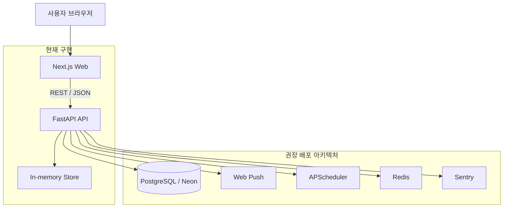

# 자산도우미

사회초년생이 결제 직전 한 박자 멈추고, 저축과 소비 습관을 함께 다듬도록 돕는 자산관리 동반자 애플리케이션입니다.

이 저장소는 현재 MVP부터 Beta까지의 기능을 TDD 방식으로 확장하는 기준 코드베이스입니다. 백엔드는 FastAPI와 in-memory store로 빠르게 기능을 쌓고, 프론트엔드는 Next.js로 사용자 화면을 제공합니다.

## 애플리케이션 개요

- 결제, 저축, 수입 내역을 입력하고 분신 상태(HP, 성장도)로 확인합니다.
- 멈춤 카드, 자동저축, 그룹 챌린지, 학습 카드 같은 행동 유도 기능을 제공합니다.
- 오픈뱅킹 연결, 웹 푸시 구독, 계정/동의 관리 기능을 포함합니다.
- 백엔드는 SQLite 스냅샷 저장소를 사용해 현재 상태를 파일 기반으로 보존합니다.
- 현재 구현은 TDD 슬라이스에 맞춰 단위 테스트, 통합 테스트, E2E 테스트를 함께 유지합니다.

## 전체 아키텍처 다이어그램



## 시작하기

1. 저장소 루트로 이동합니다.
2. 사전 개발 환경 요구사항을 확인합니다.
3. 백엔드와 프론트엔드를 각각 실행합니다.
4. 테스트를 실행해 현재 상태를 확인합니다.

## 사전 개발 환경 요구사항

- Python 3.12 이상
- Node.js 22 이상
- npm 사용 가능 환경
- Microsoft Edge 또는 Playwright 브라우저 실행이 가능한 환경
- Windows, macOS, Linux 중 하나의 개발 환경

외부 연동에 필요한 API 정리는 [docs/external-integrations.md](docs/external-integrations.md)에 따로 정리했습니다.

## 애플리케이션 실행하기

### 1) 백엔드 실행

```bash
cd apps/api
python -m uvicorn asset_helper.main:create_app --factory --reload
```

### 2) 프론트엔드 실행

```bash
cd apps/web
npm install
npm run dev
```

### 3) 백엔드와 프론트엔드 동시 실행

- 루트에서 `./dev.ps1`를 실행하면 하나의 창에서 백엔드와 프론트엔드가 동시에 실행됩니다.
- 배치 파일을 선호하면 `./dev.bat`를 실행해도 됩니다.
- 하나의 창에서 동시 실행하려면 `./dev.single.ps1` 또는 `./dev.single.bat`를 사용합니다.
- VS Code에서 `Run Task`를 열고 `dev: all`을 선택해도 동일하게 병렬 실행할 수 있습니다.
- 개별 실행이 필요하면 `api: dev`와 `web: dev`를 각각 실행할 수 있습니다.

### 4) 로컬 확인

- 메인 접속 주소(이 디렉토리 실행): `http://127.0.0.1:3100`
- 백엔드 API: `http://127.0.0.1:8000`
- 백엔드 문서(Swagger): `http://127.0.0.1:8000/docs`

## 애플리케이션 배포하기 (Azure + azd + Dockerfile)

이 저장소는 `azd` 기준으로 `apps/api`, `apps/web`를 각각 Docker 이미지로 빌드하여 Azure Container Apps에 배포하도록 구성되어 있습니다.

### 1) 사전 준비

- Azure CLI 로그인: `az login`
- Azure Developer CLI 로그인: `azd auth login`

### 2) 환경 생성

```bash
azd env new asset-helper-dev
```

### 3) 인프라 생성 + 앱 배포

```bash
azd up
```

`azd up`는 아래를 한 번에 수행합니다.

- `infra/main.bicep` 기반 Azure 리소스 프로비저닝
- `apps/api/Dockerfile`, `apps/web/Dockerfile` 기반 이미지 빌드
- Azure Container Apps 서비스(`api`, `web`) 배포

### 4) 코드 변경 후 재배포

```bash
azd deploy
```

### 주요 배포 파일

- `azure.yaml`
- `infra/main.bicep`
- `infra/main.parameters.json`
- `apps/api/Dockerfile`
- `apps/web/Dockerfile`

## 애플리케이션 테스트하기

### 백엔드 테스트

```bash
python -m pytest tests/unit tests/integration -q
```

### 프론트엔드 E2E 테스트

```bash
cd apps/web
npm run test:e2e
```

### 전체 검증 포인트

- 단위 테스트: 도메인 로직과 저장소 상태 전이 검증
- 통합 테스트: FastAPI 라우트와 응답 계약 검증
- E2E 테스트: 브라우저에서 주요 사용자 흐름 검증
